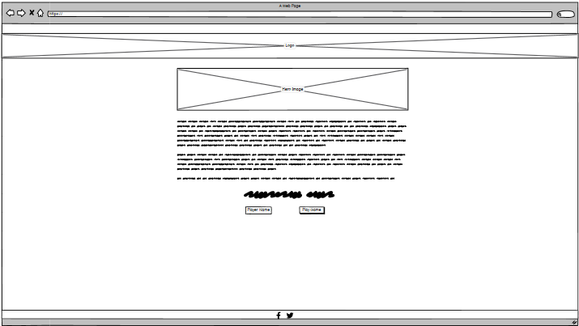

# **PokeBattle**

A toptrumps like webapp created for the second milestrone projects for Code Institues full stack developer course. 

[The deployed website can be found here.](https://monkphin.github.io/PokeBattle/)

//Insert mockups

# Contents 

- [User Experience](#user-experience)

  - [Site Owner Goals](#siteowner-club-goals)
  - [A Visitors Goals](#visitor-goals)

- [User Stories](#user-stories)

  - [Page Visitor](#site-visitor)
  - [Mobile User](#mobile-user)
  - [Page Owner](#site-owner)

- [Design](#design)

  - [Wireframes](#wireframes)
  - [Colour Palette](#colour-palette)
  - [Typography](#typography)
  - [Images](#images)
  - [Icons](#icons)
  - [Gameplay](#gameplay)

- [Features](#features)

  - [Header](#header)
  - [Footer](#footer)
  - [Index Page](#Index-page)
  - [Game Page](#game-page)
  - [404 Page](#404-page)
  - [Logo](#logo)
  - [Hero Image](#hero-image)
  - [Instructions](#instructions)
    - [sessionStorage](#sessionstorage)
    - [handleSubmit](#handlesubmit) 
  - [Footer](#footer)
  - [Card Area](#card-area)
    - [cardPicker](#cardpicker)
    - [cardInit](#cardinit)
    - [buildCard](#buildcard)
    - [createDecks](#createdecks)
    - [showCards](#showcards)
    - [cardRender](#cardrender)
    - [listCreator](#listcreator)
  - [Deck Count Area](#deck-count-area)
    - [setPermElements](#setpermelements)
    - [updateDeckCounts](#updatedeckcounts)
  - [Message Area](#message-area)
    - [displayPlayerName](#displayplayername)
    - [resolveRound](#resolveround)
    - [outComeHandler](#outcomehandler)
    - [endGame](#endgame)
  - [Future Features](#future-features)

- [Bugs and Issues](#bugs-and-issues)

  - [Resolved Bugs](#resolved-bugs )
  - [Unresolved Bugs](#unresolved-bugs )

- [Technology](#technology)

  - [Languages](#languages)
  - [Frameworks and Programs](#frameworks-and-programs)

- [Testing](#testing-and-validation)

  - [HTML Validation](#html-validation)
  - [CSS Validation](#css-validation)
  - [Javascript Validation](#javascript-validation)
  - [Accessibility](#accessibility)
  - [User Testing](#user-testing)
  - [User Story Testing](#user-story-testing)
  - [Performance](#performance)
  - [Device and Browser Testing](#device-and-browser-testing)
  - [Responsiveness](#responsiveness)
  - [Automated Testing](#automated-testing)
  - [User Stories](#user-story-testing)

- [Version Control and Deployment](#version-control-and-deployment)
  - [Repository Creation](#repo-creation)
  - [Cloning Locally](#cloning-locally)
  - [Version Control](#version-control)
    - [CLI](#CLI)
    - [GitHub Website](#github-website)
  - [Branching](#branching)
  - [Deployment](#deployment)

- [Credits](#credits)

# User Experience

PokeBattle is an online Top Trumps like game created to allow fans of the Pokemon series and TopTrumps games to have a single player game that can be played online. Due to the nature of the game and the IP, the site needs to be relatively simplistic in its display as well as using a bright, simple colour pallette. 

## Site Owner goals
- To provide a fun game for visitors to engage with. 
- For the game to be visually appealing 
- For the game to be simplistic to play but able to present a challenge to players
- The site should have an easy to navigate structure that responds to the device its accessed from. 
- For social and professional channels to be signposted. 
- To have some level of accessability built into the game. 

## Visitor Goals
- For the game to be easy to play.
- For the game to keep me informed of whats happening.
- To be able to play the game on any device I choose to access it from. 
- To have access to the site owners socials so I can follow them and see what else they may be working on. 
- For the site to be easy to use irrespective of the device I access it from
- To be able to use some form of keyboard input

# User Stories

## Site Owner
1. As the site owner, I want the site to be responsive to allow users to access it and have the best experience from any device. 
2. As the site owner, I want players to need to enter their name so that the game can respond more personally to them. 
3. As the site owner, I want some degree of accessability to be considered in the way the site works so that the site can be used by people who may have accessibility issues. 
4. As the site owner, I want the game to use randomly derived stats, so that I can limit the amount of research needed to generate the card data, allow the data to be card theme agnostic and to ensure no two games are the same. 
5. As the site owner I want the player stats to be shown to the player but not be able to see the opponents until after they have picked so they know which stats have which values to pick when playing but are unable to see the opponents stats so they do not know the best options. 
6. As the site owner, I would like the decks to be randomly shuffled so that the player and computer can have different hands. 
7. As the site owner, I want to ensure that the cards are removed from the deck as each players hand is created and the player is made aware of hand sizes so that they may better experience the game. 
8. As the site owner, I want to ensure the game page cannot be accessed without having a name saved by the game so that the player is presented with the rules and I know they cannot bypass the page displaying them. 
9. As the site owner, I want to ensure the game cannot be made to function in a way that causes issues with game play. 
10. As the site owner I want the player to be able to find my social media links so they can connect with me and follow for other projects I'm working on or for new game play and site features. 

## Site Visitor
11. As a site visitor, I want the gameplay to be relatively simplistic, so I can enjoy the game without having to remember complex rules. 
12. As a site visitor, I want to be able to play the game against a computer opponent, so I can play solo. 
13. As a site visitor, I want to be able to pick and choose which card statistics I am comparing with the opponents card and these to be visible to me, so I can have some choice of outcome.
14. As a site visitor, I would like the site to render well on any device I should choose to access it from. So I can play the game irrespective of the device. 
15. As a site visitor. I want to be able to go back to the home page, to allow me to exit the game without leaving the site. 
16. As a site visitor, I want to be able to quickly find out how to play the game so that I can enjoy the game without having to look anything up. 
17. As a site visitor I want to know how to can find the owner of the site so that I can find out if they have new features coming. 
18. As a site visitor, I would like to see the outcome of each round, so I can better see how the round was won or lost. 
19. As a person playing the game I would like to see the number of cards each player has les, so I can understand how much risk is involved in my turn. 
20. As the player of the game I would like to see the final outcome of the game, so that I know how I performed. 

# Design
The design needed to be relatively simplistic, reflecting the nature of the game and IP in use. Ideally with minimal moving content, with the pertinent data, such as cards, output etc all being visible on a single screen. This meant using CSS query selectors to allow for the cards to be displayed side by side when shifting resolutions. Since on smaller screens any other card positioning would result in some data being pushed off the bottom. Overall the design has been kept deliberately clean and simple in order to not distract from the main content. With areas of note being called out in bounding boxes that sit above the background. Initial testing was done with drop shadows on these elements and the cards. However it was decided that the shadows detracted from the overall clean look and could lead to potential distraction due to the UI being a little too busy. 

## Wireframes:

Wireframes were created with Balsamiq software to provide rough mockups for layout.

<details>
<summary>Index page</summary>


</details>

<details>
<summary>Game</summary>


</details>

<details>
<summary>404</summary>


</details>

## Colour Palette.

The colours selected were chosen to be inline with the bright, bold colours in use by the Pokemon IP, keeping things relatively simple but allowing all the elements to clearly standout and be viewable, as well as text to be legible. 

After some experimentation I settled on a simple range of colours between blue and white, since these seemed to be most pleasant without providing too much conflict with the varying colours of the cards. 

## Typography.

The font was picked due to being somewhat reflective of the Pokemon IP's font, while also remaining clear to read at varying font sizes and weights. 
Based on the simple appearance of the cards and IP as a whole I elected to stick to a single font to ensure this simplicity was reflected throughout. 

## Images
Images were sourced from a few locations - the pokemon themselves were from PokemonDB, the logos from a PokemonGo fan site, the cards from a Pokemon card making website. Credits for these will be provided at the end of the readme. 

## Icons

Icons were provided by [FontAwesome](https://fontawsome.com)

## Gameplay

A rough map of how the game should play was created with LucidChart to help show and drive how the game should function. This helped derive the core javascript functions that would be needed in order for the game to work. 


<details>
<summary>Gameplay Flow Map</summary>

</details>

# Features

The website consists of 3 pages:
- Index page
- game page
- 404 page

The game page is only accessible via the 'play game' button, once the player has entered their name into the text field. If the player tries to bypass entering their name an alert is generated advising them to enter their name, similarly if they enter all spaces the same alert will be generated. The custom 404 page is present in case a visitor somehow manages to access a nonexistent part of the website and offers methods to get back to the index page. Their is also an if statement to checks if the player name has been stored when accessing the game.html page. If this has not been stored, it redirects the player to the index.html page to ensure they enter their name and read how the play the game using window.location.assign(). This is incase the game.html page is accessed directly via bookmarks or direct linking and ensures that players cannot just start the game without accessing the index page first. 


## Index page
The sites home page, or index page, provides the basic rules of the game, as well as an option for the player to enter their name and proceed through to the game itself. The page features the sites logo, a hero image, the game instructions with a form at the end and also a footer containing social media links. This page responds to keyboard input, specifically the tab and enter keys, so has some degree of accessability built in. Its deign is mobile first and is fully responsive. 

 Outer pipes  Cell padding 
No sorting
|    | Story point                                                                                                                                                                                                         | How                                                                                                                                                                                                                    |
| -- | ------------------------------------------------------------------------------------------------------------------------------------------------------------------------------------------------------------------- | ---------------------------------------------------------------------------------------------------------------------------------------------------------------------------------------------------------------------- |
| 1  | As the site owner, I want the site to be responsive to allow users to access it and have the best experience from any device.                                                                                       | The index page is designed to be fully responsive rendering in a manner that is appropriate for the device it is being browsed on. This has been tested on multiple virtualised and physical devices to confirm this.  |
| 2  | As the site owner, I want players to need to enter their name so that the game can respond more personally to them.                                                                                                 | Their is a form on the index page,w here a player can enter their name. This stores the name for use by parts of the game and its entry triggers the game page loading, taking players into the game itself.           |
| 3  | As the site owner, I want some degree of accessability to be considered in the way the site works so that the site can be used by people who may have accessibility issues.                                         | The index page responds to tab based input, allowing users to navigate the website using their keyboards.                                                                                                              |
| 8  | As the site owner, I want to ensure the game page cannot be accessed without having a name saved by the game so that the player is presented with the rules and I know they cannot bypass the page displaying them. | The form will not allow the player to proceed without entering a name. It also uses the trim function to ensure no empty spaces are accepted. In both cases it triggers an alert to tell the user to enter their name. |
| 10 | As the site owner I want the player to be able to find my social media links so they can connect with me and follow for other projects I'm working on or for new game play and site features.                       | The footer of the page contains links to several social channels, including github, linkedin, facebook and twitter.                                                                                                    |
| 11 | As a site visitor, I want the gameplay to be relatively simplistic, so I can enjoy the game without having to remember complex rules.                                                                               | How to play the game is outlined within a couple of paragraphs on the index page. It highlights that interaction is via selecting a higher value stat.                                                                 |
| 14 | As a site visitor, I would like the site to render well on any device I should choose to access it from. So I can play the game irrespective of the device.                                                         | The index page is responsive by design and was built with a mobile first approach. This has been tested on multiple resolutions and will adjust to different resolutions as needed.                                    |
| 16 | As a site visitor, I want to be able to quickly find out how to play the game so that I can enjoy the game without having to look anything up.                                                                      | The index page includes a couple of paragraphs that outline how to play the game.                                                                                                                                      |
| 17 | As a site visitor I want to know how to can find the owner of the site so that I can find out if they have new features coming.                                                                                     | The footer of the page contains links to its owners social networks.                                                                                                                                                   |


## Game Page
The game page is where the real meat of the content is, with the majority of whats on display being dynamically generated by the Javascript which drives the game. It has 5 main areas that are visible to the player at all times depending on their screen resolution. The logo, the card area, the deck size area, the game message area and finally the footer. These five areas are statically coded to the page, along with some of the text in the deck size area. The cards, card names and card stats are all dynamically generated as are the deck size counts and the responses in the response area. 

Examples of responses the game will provide to the player include the initial welcome message, where the players name is mentioned and they are wished luck. Messages outlining win, loss or draw outcomes for both the player or the computer as well as information around the selected stat name and the stat value and finally a prompt to which players is taking the next turn, which was added after testing showed that if you skimmed the other parts of the message it wasn't always obvious who's turn it was. Finally on the game end, a message outlining how many turns, wins, losses and draws occurred in the game with an button inviting them to play again. As with the rest of the site, this is fully responsive and has some accessability functionality, where I have ensured that that card stats are selectable and can be triggered via keyboard inputs. 

Much like the rest of the site, its been designed with mobile first in mind and is responsive to varying screen sizes. However, this is the only page that uses bootstrap, which longer term I would like to migrate it away from using to match the rest of the site and hopefully simplify the CSS. 

|    | Story point                                                                                                                                                                                                         | How                                                                                                                                                                                                                    |
| -- | ------------------------------------------------------------------------------------------------------------------------------------------------------------------------------------------------------------------- | ---------------------------------------------------------------------------------------------------------------------------------------------------------------------------------------------------------------------- |
| 1  | As the site owner, I want the site to be responsive to allow users to access it and have the best experience from any device.                                                                                       | The index page is designed to be fully responsive rendering in a manner that is appropriate for the device it is being browsed on. This has been tested on multiple virtualised and physical devices to confirm this.  |
| 2  | As the site owner, I want players to need to enter their name so that the game can respond more personally to them.                                                                                                 | Their is a form on the index page,w here a player can enter their name. This stores the name for use by parts of the game and its entry triggers the game page loading, taking players into the game itself.           |
| 3  | As the site owner, I want some degree of accessability to be considered in the way the site works so that the site can be used by people who may have accessibility issues.                                         | The index page responds to tab based input, allowing users to navigate the website using their keyboards.                                                                                                              |
| 8  | As the site owner, I want to ensure the game page cannot be accessed without having a name saved by the game so that the player is presented with the rules and I know they cannot bypass the page displaying them. | The form will not allow the player to proceed without entering a name. It also uses the trim function to ensure no empty spaces are accepted. In both cases it triggers an alert to tell the user to enter their name. |
| 10 | As the site owner I want the player to be able to find my social media links so they can connect with me and follow for other projects I'm working on or for new game play and site features.                       | The footer of the page contains links to several social channels, including github, linkedin, facebook and twitter.                                                                                                    |
| 11 | As a site visitor, I want the gameplay to be relatively simplistic, so I can enjoy the game without having to remember complex rules.                                                                               | How to play the game is outlined within a couple of paragraphs on the index page. It highlights that interaction is via selecting a higher value stat.                                                                 |
| 14 | As a site visitor, I would like the site to render well on any device I should choose to access it from. So I can play the game irrespective of the device.                                                         | The index page is responsive by design and was built with a mobile first approach. This has been tested on multiple resolutions and will adjust to different resolutions as needed.                                    |
| 16 | As a site visitor, I want to be able to quickly find out how to play the game so that I can enjoy the game without having to look anything up.                                                                      | The index page includes a couple of paragraphs that outline how to play the game.                                                                                                                                      |
| 17 | As a site visitor I want to know how to can find the owner of the site so that I can find out if they have new features coming.                                                                                     | The footer of the page contains links to its owners social networks.                                                                                                                                                   |
| 18 | As a site visitor, I would like to see the outcome of each round, so I can better see how the round was won or lost.                                                                                                | The message area on the game page shows the outcome of each round at the end of the round                                                                                                                              |
| 19 | As a person playing the game I would like to see the number of cards each player has les, so I can understand how much risk is involved in my turn.                                                                 | The game page contains the deck count area, which shows the number of cards in each players hands.                                                                                                                     |
| 20 | As the player of the game I would like to see the final outcome of the game, so that I know how I performed.                                                                                                        | The message area also shows the final outcome of the game as well as presenting options to play again or to go back to the index page.                                                                                 |

## 404 Page
The 404 page is a relatively simple, static HTML page. It features the logo, a heading, an image, some text with a link and the footer. The objective of the 404 page is to provide a themed page which fits the look and feel of the rest of the site incase a visitor manages to access a none existent page which they can use to return to the home page. This was derived from the same layout used on the index page and shares a lot in common with its design and CSS styling, to the point of using the same classes in several cases to avoid duplication. Since it's design is based on the homepage, the logo and footer are present as is a centrally located div which displays any text or images. With the only missing feature being the hero image. Much like the rest of the site, its been designed with mobile first in mind and is fully responsive.

|    | Story Point                                                                                                                                                                                   | How                                                                                                                |
| -- | --------------------------------------------------------------------------------------------------------------------------------------------------------------------------------------------- | ------------------------------------------------------------------------------------------------------------------ |
| 1  | As the site owner, I want the site to be responsive to allow users to access it and have the best experience from any device.                                                                 | The site is fully responsive, with images, text and logoss adjust to the size of the screen in use.                |
| 3  | As the site owner, I want some degree of accessability to be considered in the way the site works so that the site can be used by people who may have accessibility issues.                   | The site responds to keyboard input via the tab and enter keys                                                     |
| 10 | As the site owner I want the player to be able to find my social media links so they can connect with me and follow for other projects I'm working on or for new game play and site features. | Like all pages on the site, the footer is present on the 404 page which contains links to the site owners socials. |
| 14 | As a site visitor, I would like the site to render well on any device I should choose to access it from. So I can play the game irrespective of the device.                                   | The site iwas designed to be mobile first and is fully responsive to varying device sizes.                         |
| 17 | As a site visitor I want to know how to can find the owner of the site so that I can find out if they have new features coming.                                                               | The footer contains links to the site owners social networks.                                                      |

## Logo
The header exists predominantly to show the sites logo. However it is clickable and will return the player back to the index page should they feel the need to navigate away from the game page while remaining on the website. Its fully responsive and will adapt to the size of the browser window the site is loaded in. THe logo is consistently presented on every page of the site. 

|    | Story Point                                                                                                                                                 | How                                                                                                                   |
| -- | ----------------------------------------------------------------------------------------------------------------------------------------------------------- | --------------------------------------------------------------------------------------------------------------------- |
| 1  | As the site owner, I want the site to be responsive to allow users to access it and have the best experience from any device.                               | The logo is a single image that is sized by percentage, allowing it to be able to display on devices of varying size. |
| 14 | As a site visitor, I would like the site to render well on any device I should choose to access it from. So I can play the game irrespective of the device. | The logo is a single image that is sized by percentage, allowing it to be able to display on devices of varying size. |
| 15 | As a site visitor. I want to be able to go back to the home page, to allow me to exit the game without leaving the site.                                    | The logo functions as a link to the index page of the site.                                                           |

## Hero Image
The hero image is displayed on the index page only. It provides a picture of two pokemon trainers about to battle, helping to give a sense of what is to come to the visitor where the game will see you face off against a computer controlled opponent. Its fully responsive and will adjust to meet the dimensions of the screen that is being used to browse the website. 

|    | Story Point                                                                                                                                                 | How                                                                                                   |
| -- | ----------------------------------------------------------------------------------------------------------------------------------------------------------- | ----------------------------------------------------------------------------------------------------- |
| 1  | As the site owner, I want the site to be responsive to allow users to access it and have the best experience from any device.                               | The hero image is fully responsive and will shift in size depending on the size of the device in use. |
| 14 | As a site visitor, I would like the site to render well on any device I should choose to access it from. So I can play the game irrespective of the device. | The hero image is fully responsive and will shift in size depending on the size of the device in use. |

## Instructions
These are provided to ensure that players know the basics of how the game will function. Advising on how the game round should flow, what the objective of the turn and game is, as well as how many cards the two players have. This also presents an opportunity for the player to enter their name, which is called on at the end of hte game to congratulate or commiserate with the with player. Like other aspects of the site this is fully responsive and will react to varying screen resolutions, adjusting as needed. 

### sessionStorage
The players name is stored in sessionStorage by some initial calls in the javascript which check it the DOM is loaded before using an if statement to check for the form. If the form is present on a submit event, it will sent the contents of the form to the handleSubmit function. 

### handleSubmit
HandleSubmit serves a couple of purposes. Firstly, it uses the inbuilt function preventDefault to prevent default behaviour on the form, it then, via an if statement, captures the players name and applies a trim to it - removing whitespace. If however the name is submitted as just whitespace or the player tries to bypass entering their name and instead just hits the play game button it will trigger an alert to the player advising to enter their name. 

|    | Story Point                                                                                                                                                 | How                                                                                                                  |
| -- | ----------------------------------------------------------------------------------------------------------------------------------------------------------- | -------------------------------------------------------------------------------------------------------------------- |
| 1  | As the site owner, I want the site to be responsive to allow users to access it and have the best experience from any device.                               | The container for the instructions is styled to allow it to be flexible in terms of sizing.                          |
| 2  | As the site owner, I want players to need to enter their name so that the game can respond more personally to them.                                         | The intrusctions container also contains a form allowing the player to enter their name.                             |
| 14 | As a site visitor, I would like the site to render well on any device I should choose to access it from. So I can play the game irrespective of the device. | The instructions are styled in a way that lets them dynamically shift depending on the device and resolution in use. |
| 16 | As a site visitor, I want to be able to quickly find out how to play the game so that I can enjoy the game without having to look anything up.              | The instructions contain a few paragraphs which quickly and simply explain how the game is played.                   |

## Footer
The footer provides links to the the site owners socials, in this case Facebook, Github, Twitter and LinkedIn. The footer is present on all pages of he site.  

|    | Story Point                                                                                                                                                                                   | How                                                                                            |
| -- | --------------------------------------------------------------------------------------------------------------------------------------------------------------------------------------------- | ---------------------------------------------------------------------------------------------- |
| 10 | As the site owner I want the player to be able to find my social media links so they can connect with me and follow for other projects I'm working on or for new game play and site features. | The footer contains links to 4 commonly used personal and professional social media platforms. |
| 17 | As a site visitor I want to know how to can find the owner of the site so that I can find out if they have new features coming.                                                               | The footer contains links to 4 commonly used personal and professional social media platforms. |

## Card Area
The card area of the game page is used to display the card images, the name of the card name and the card stats. Card creation is started early in the Javascript file when cardPicker is first called. This is fully responsive with all aspects of what is on show adapting to screen size shifts. For smaller screens the stats are shown in a 2 x 2 grid, rather than a vertical list. This is done for improved UI and UX, since initial tests with a vertical list as is used on larger screens showed issues with how much space was available to target for each stat item, which would result in stats being incorrectly tapped. The following functions are all used in some form or another to present data here. 

### cardPicker
The cardPicker function kicks off a chain of functions which all rely on each other to create the cards. Firstly is calls on the createDecks function to start generating each players hand, to enable this createDecks calls cardInit. This function is first called by the currentURL const, which uses an if statement to check if the current URL includes game.html. 

### cardInit
CardInit stores two arrays which contain the card name and the card image - the reason for this is to mitigate the need to generate cards for several screen sizes to ensure the card name is legible on different sized devices. Since the name is a string of data, it can be manipulated with CSS when its presented to the user, meaning we can adjust its appearance as needed. To generate the cards, it will iterate through both arrays and push each iteration to the buildCard function. 

### buildCard
The sole purpose of buildCard is to create each card as an object of objects where the card name and image are stored as two of the 6 objects it contains with the other four being part of the stats array within the cards object. The stats are randomly generated as the cards object is created. 

### createDecks
Once cardInit has completed iterating through the arrays to create all 48 cards, createDecks then hands these to the shuffleCards variable, where the array of cards is shuffled using a Fisher-Yates algorithm. Finally the createDecks function breaks this newly shuffled array into two unique decks, using slice and splice to ensure that neither deck can contain duplicate cards. As a result of this, both decks should be fully random with fully randomised card stats. 

### showCards
cardPicker then takes the topmost (array entry 0) card from the player and opponent deck arrays and presents them, along with if the card is the players or the opponents to the showCard function. ShowCards main purpose is to derive which players card we're referencing with an if statement, before handing this to cardRender, which is responsible for rendering the card onscreen. This function also relies on the presentData helper function in order to simplify rendering data. The presentData function is utilised by several other functions throughout the game to help minimise repetition of code for creating HTML elements. 

### cardRender
CardRender initially checks for the end of the game and returns out if this is true. Beyond this its purpose is relatively trivial, with its sole purpose being to bring all the various parts of the card together to present on screen to the player

### listCreator
Finally cardRender also calls on listCreator, which is responsible for displaying and handling click event on the card stats via a child function called handleInteraction. listCreator also ensures that the opponent stats remain hidden until a stat is picked. 

### handleInteraction
This child functions purpose is to check if its the players turn. If this is true it allows the player to interact with the card. It will also, once the player has made their choice show the opponent cards stats to the player. 

|    | Story Point                                                                                                                                                                                                                                                                           | How                                                                                                                                                                                                                                                                  |
| -- | ------------------------------------------------------------------------------------------------------------------------------------------------------------------------------------------------------------------------------------------------------------------------------------- | -------------------------------------------------------------------------------------------------------------------------------------------------------------------------------------------------------------------------------------------------------------------- |
| 1  | As the site owner, I want the site to be responsive to allow users to access it and have the best experience from any device.                                                                                                                                                         | Much like the rest of the site, the card area is designed to be responsive to varying screen sizes and resolutions. It will shift its content around as needed to ensure that the cards remain usable and visible.                                                   |
| 3  | As the site owner, I want some degree of accessability to be considered in the way the site works so that the site can be used by people who may have accessibility issues.                                                                                                           | The interactive options on the cards are accessible via the tab key and can be actioned using the enter key.                                                                                                                                                         |
| 4  | As the site owner, I want the game to use randomly derived stats, so that I can limit the amount of research needed to generate the card data, allow the data to be card theme agnostic and to ensure no two games are the same.                                                      | The stats that the cards display are randomly generated from the buildCard function when the cards are created at the start of the game.                                                                                                                             |
| 5  | As the site owner I want the player stats to be shown to the player but not be able to see the opponents until after they have picked so they know which stats have which values to pick when playing but are unable to see the opponents stats so they do not know the best options. | The listCreator function builds the card stats in a way that ensures the opponent stats are hidden until the player clicks on their chosen stat, via the handleInteraction subfunction so the player can compare what they selected vs what the opponent card shows, |
| 6  | As the site owner, I would like the decks to be randomly shuffled so that the player and computer can have different hands.                                                                                                                                                           | The createDecks function hands the array of created cards to the shuffleCards variable, which shuffled the deck using a fisher-yates algorithm.                                                                                                                      |
| 13 | As a site visitor, I want to be able to pick and choose which card statistics I am comparing with the opponents card and these to be visible to me, so I can have some choice of outcome.                                                                                             | The handleInteraction subfunction function allows the player to interact with their card stats when its their turn. This also shows the opponent stats once the player has selected their stat.                                                                      |
| 14 | As a site visitor, I would like the site to render well on any device I should choose to access it from. So I can play the game irrespective of the device.                                                                                                                           | The site is designed with mobile first in mind. It features a design that adapts to the device and its screen resolution as needed.                                                                                                                                  |


## Deck Count Area

The deck area is designed purely to show the counts of each players deck so they can be aware of how the game is going. Much like with the card area, a function is called early in the javascript which helps set this up in the form of setPermElements. The actual dynamic card counts are displayed by the updateDeckCount function, which is called by the outcomeHandler function. Much like all other aspects of the site, this is fully responsive with the text adapting to suit the screen it is on. Since this includes nothing the player needs to interact with directly its not set up to be accessible via tabbing. The below functions are all utilised in some form to show the content in this area. 

### setPermElements
This function has a single real purpose, which is to display the static text in the card count area. It does this using the presentData helper function mentioned earlier. This is called by the same currentURL variable that kicks off all other starting functions. 

### updateDeckCount
This simple function exists purely to render the current count of cards in each players hand. It does this by adding the length to the player-deck-size and opponent-deck-size elements. 

|    | Story Point                                                                                                                                         | How                                                                                                                            |
| -- | --------------------------------------------------------------------------------------------------------------------------------------------------- | ------------------------------------------------------------------------------------------------------------------------------ |
| 1  | As the site owner, I want the site to be responsive to allow users to access it and have the best experience from any device.                       | Like all other aspects of the site, the deck Count area is designed to be responsive and will adapt to different screen sizes. |
| 19 | As a person playing the game I would like to see the number of cards each player has les, so I can understand how much risk is involved in my turn. | The deck count area specifically displays the number of cards in each players hand.                                            |

## Message Area
The message area is the final part of the game page and is where the player is first greeted, outcomes of each round are displayed and finally the end of game statistics are shown. 
Again, like the rest of the site this is fully responsive and at the end of the game is tabbable via the 'new game' button, allowing people using keyboard entry to start another game. 
All the content here is dynamically generated by javascript, its default state between rounds is empty. The initial welcome message is displayed by the displayPlayerName function. The following functions are all part of how messages are displayed here. 

### displayPlayerName
This function is called early in the javascript, in the same currentURL variable that triggers the other parts of the script mentioned so far. DisplayPlayerName calls on the retrievePlayerName function to retrieve the name from sessionStorage. The retrievePlayerName function also includes an if statement which checks to see if playerName is true - implying its been saved and stored, if its not, it will instead load the index.html page, ensuring the player enters their name and is able to read the rules if they choose to. This serves to prevent the game.html page being accessed directly if their is no stored playerName in the current browser session, since we're using sessionStorage. 

### resolveRound
The mainstay of messages are displayed via the resolveRound function. This is called as part of the game loop, being triggered by the statSelection and opponentTurn functions which handle the player and opponent turns respectively. Its a little messy and could potentially be simplified, but in its essence resolveRound is a bunch of if/if else statements which are looking testing the outcomes of the player and opponent scores, looking to see which is the larger number and calling on outcomeHandler to show the relevant output based on the result. 3 of the statements are also checking to see if player-card is present in the arguments sent to the function to ensure that the player focused messages are sent when its the players turn and the enemy focused messages are sent when its the opponent players turn. These statements will also set the playerTurn variable to be either true or false depending on which player won, as well as sending the outcome of the turn to the winLossCounter function so the final results can be displayed at the end of the game. Depending on which If/if else statement is triggered this function can also invoke the opponentTurn function finally the state of the game is checked via the checkEndGame function to see if the game needs to end or not, with disableStatItems being set to true so that the player cannot interact with their card element and queue multiple turns to be processed. 

### outcomeHandler
the outComeHandler function is directly responsible for showing the results of resolveRound to the player in the message area. It uses the presentData helper function to create the elements being displayed. Finally it will, depending on the outcome move the cards between the winning and losing hands in the result of a win/loss condition, or push them back to the bottom of the hands in the result of a draw. Finally this will call on the updateDeckCount function to ensure the player is kept aware of how many cards are in each hand. 

### endGame
The final function that is used in the showing of data in the message area is the endGame function. This uses a the retrievePlayerName and presentData functions to call on the name of the player before sending the correct output to the presentData function to be packaged into the needed HTML elements. It also present the new game button, which resets and restarts the game state. 

|    | Story Point                                                                                                                                                                                                         | How                                                                                                                                                                                              |
| -- | ------------------------------------------------------------------------------------------------------------------------------------------------------------------------------------------------------------------- | ------------------------------------------------------------------------------------------------------------------------------------------------------------------------------------------------ |
| 1  | As the site owner, I want the site to be responsive to allow users to access it and have the best experience from any device.                                                                                       | The message area, like the rest of the site is designed to be fully responsive.                                                                                                                  |
| 2  | As the site owner, I want players to need to enter their name so that the game can respond more personally to them.                                                                                                 | The message area uses the player name stored in sessionStorage to address some messages to the player using their name.                                                                          |
| 3  | As the site owner, I want some degree of accessability to be considered in the way the site works so that the site can be used by people who may have accessibility issues.                                         | The buttons at the end of the game that are shown in the message area are interactable via the tab key and can be actioned with the enter key.                                                   |
| 7  | As the site owner, I want to ensure that the cards are removed from the deck as each players hand is created and the player is made aware of hand sizes so that they may better experience the game.                | The outComeHandler function is responsible for moving cards between hands depending on round outcomes.                                                                                           |
| 8  | As the site owner, I want to ensure the game page cannot be accessed without having a name saved by the game so that the player is presented with the rules and I know they cannot bypass the page displaying them. | The displayPlayerName function checks to see if their is a stored playerName in session storage. If one is not present, this redirects the browser to the index.htrml page.                      |
| 9  | As the site owner, I want to ensure the game cannot be made to function in a way that causes issues with game play.                                                                                                 | disableStatItems ensures that the stat items cannot be interacted with when the player is not supposed to interact with these, preventing a a major cause of malfunction that was detected.      |
| 14 | As a site visitor, I would like the site to render well on any device I should choose to access it from. So I can play the game irrespective of the device.                                                         | The message area is designed to ensure it renders correctly on all devices and is fully responseive with a mobile first design appraoch.                                                         |
| 15 | As a site visitor. I want to be able to go back to the home page, to allow me to exit the game without leaving the site.                                                                                                                                                              | The site logo is also a clickable link that takes the player back to the sites home page. The endOfGame function displays two buttons, one allowing the player to play another game the other allowing them to go back to the home page.                             |
| 18 | As a site visitor, I would like to see the outcome of each round, so I can better see how the round was won or lost.                                                                                                | The message area displays if the round was won, lost or drawn. It shows the selected stat name and the values of both the player and opponent for that stat. It also confirms whos turn is next. |
| 20 | As the player of the game I would like to see the final outcome of the game, so that I know how I performed.                                                                                                        | At the end of the game the message area shows a tally of rounds won, lost or drawn, as well as the total number of rounds taken.                                                                 |

## Other functions

### storePLayerName
As per the name, this function exists to store the players name in sessionStorage

### retrievePlayerName
Much like storePlayerName, this function predominantly exists to retrieve the players name. However it also checks if the playerName exists as a stored entity. If it doesn't it loads the index page to prevent the player from directly accessing the game.html page without first entering their name or reading the rules. 

### presentData
PresentData is a helper function thats called on by a few other functions. Effectively it takes the arguments handed to it - HTML tag and contents and encapsulates them into 'element' it exists to make functions that need to present data to the HTML of the site a little simpler and less repetitive. 

### disableStatItems
DisableStatItems adds the disabled class, sets pointerEvents to none and moves the tabIndex to -1 to ensure items aren't able to be interacted with when they're not supposed to be. Its a default state is to assume these should be disabled unless told otherwise at which point it removes the disabled class, sets pointer events to auto and shifts the tabIndex to 1. 

### statSelection
StatSelection takes the players selected stat and sends it, the stat name and the equivalent stat value for the opponent card to the resolveRound function. 

### checkEndGame
This function performs a quick check to see if either hand size is 0. If so it allows the endGame function to trigger. 

### opponentTurn
This function is what drives the computer player. It uses a simple Math.floor(Math.random()) to randomly pick an option from the four possible stats. It then sends the resulting stat name and the appropriate opponent and player stats to the resolveRound function. 

### winLossCounter
Finally, winLossCounter keeps track of how many rounds have been won, lost and drawn and logs these in a variable so that the endGame function can display the results to the player.  

|    | Story Point                                                                                                                                                                                                         |                                                                                                                                                                                   |
| -- | ------------------------------------------------------------------------------------------------------------------------------------------------------------------------------------------------------------------- | --------------------------------------------------------------------------------------------------------------------------------------------------------------------------------- |
| 2  | As the site owner, I want players to need to enter their name so that the game can respond more personally to them.                                                                                                 | This is required in order to play the game. The players name is stored using the storePlayerName function and retrieved using the retrievePlayerName function                     |
| 8  | As the site owner, I want to ensure the game page cannot be accessed without having a name saved by the game so that the player is presented with the rules and I know they cannot bypass the page displaying them. | The retrievePlayerName function checks to see if a playername is present and if it isnt will send the browser to the index page.                                                  |
| 9  | As the site owner, I want to ensure the game cannot be made to function in a way that causes issues with game play.                                                                                                 | disableStatItems is designed to prevent the player interacting with the game when its not their turn. This prevents a major source of malfunction that was detected with testing. |
| 12 | As a site visitor, I want to be able to play the game against a computer opponent, so I can play solo.                                                                                                              | the opponentTurn function allows the player to play a game against a computer player. This is currently using a random picker to choose which stat to play.                       |
| 13 | As a site visitor, I want to be able to pick and choose which card statistics I am comparing with the opponents card and these to be visible to me, so I can have some choice of outcome.                           | The statSelection function allows the player to pick and choose the stats they're using in each turn.                                                                             |
| 19 | As the player of the game I would like to see the final outcome of the game, so that I know how I performed.                                                                                                        | The winLossCounter keeps track of how many turns have been won, lost and drawn so these can be presented to the player at the end of the game.                                    |

## Future Features
* Ideally the player should be able to select the number of cards in the hand, allowing for varying lengths of games. 
* The ability to have two players in the game, rather than a player and the computer. 
* I'd like to add options to change the computer players difficulty. Currently it picks a random stat, rather than having any specific behaviour. Options to make it specifically pick lower stat options, or higher stat options would allow for difficulty level changes or setting the random picker to favour higher/lower numbers as needed would enable this. 
* I'd like to have the cardName and CardImage arrays inside the cardInit function auto populate from a folder - effectively meaning that more card options can be added without manually coding them, this should also limit the potential for typos on file names causing cards to not render. I believe this is possible via JQuery https://stackoverflow.com/questions/14442118/populate-array-with-file-list-in-online-directory
* I'd like to show who's turn it is in the message area between other messages being shown. Sometimes if you weren't paying attention it may not always be obvious who's turn it currently is. This would help remediate that and allow for a slightly more distracted game, where the player could be doing other things beyond playing the game. This would also allow for improved functionality with a multiplayer, allowing for more asynchronous game play to occur. 

# Bugs and issues

## Resolved bugs 

1: I had to refactor HTML due to initially using a mix of flex-box and bootstrap to try to achieve the layout I was aiming for, this was causing significant issues with rendering on the index and 4040 pages which were proving too complex to fix. Instead I simplified things and shifted to using plain CSS for the index and 404 pages The game page still currently uses bootstrap, though this is not causing significant issues beyond needing to heavily lean on media queries to ensure the stats are correctly positioned over the cards. 

2: Identified an issue where the results would clear nearly instantly after when the player wins if the prior round was the players turn and they drew. This was resolved by clearing timers at the start of the resolveRound function, preventing these from continuing and causing issues with called timers. 

3: A major issue was identified by a mix of player testing and when talking to my Mentor - effectively the player could enqueue multiple turns by repeatedly pressing the stat options, causing functions to be triggered before they were supposed to be and causing the UI to continue to cycle through the game on its own, producing unexpected results. This was resolved by calling to a new function 'disableStatItems' which would check for a boolean condition. WHen the boolean is true, it disables interactivity of the stat elements via CSS, disabling pointer events and changing the tabIndex to prevent the player from interacting with their stats and causing events to queue up and cycle through on their own. 

## Unresolved bugs 

1: The player can interact with their card a little sooner than is ideal after the opponent players turn. I believe this just needs a slight change to where disableStatItems is set to true, or perhaps a tweak to a timer. But I have as yet been unable to identify which of this will fix the issue. Or where the fix will be needed. Another alternative would be to remove the reliance on timers and move to a button to start each round. However this would remove some of the immediacy of the game. 

2: Tabbed navigation will sometimes allow the spamming of stat option presses in some situations, causing functions to be triggered before they're supposed to be (Ie before the end of the current turn) This is rare and isn't easily replicable sadly so I have been unable to identify the root cause. Though I believe this may be related to issue 2 above. 

# Technology.

## Languages

THe site is built with HTML, CSS and Javascript. It also calls on external CSS and Javascript from Bootstrap and FontAWesome, which are used to assist with layout, using bootstraps grid system and icons from FontAwesome. Much of the content on the game page is generated dynamically by the Javascript, while the index page and 404 are mostly built with static HTML, since they needed very little interactivity. 

## Frameworks and Programs. 

- Bootstrap 5.3.3

  - Used for some layout and positioning on the game page.

- W3Schools

  - Used for help with CSS and Javascript.

- Git

  - Used for version control, storage and deployment.

- GoogleFonts

  - Used to import fonts to the stylesheet.

- VSCode

  - IDE of choice.

- LucidChart

  - Used to help mock up a rough map for how the game play should flow. 

- Balsamiq

  - Wireframing program.

- WAVE

  - Used to assist with accessibility checks.

- Techsini

  - Mockup generator.

- Google Dev Tools

  - Used to help with troubleshooting.

- Pixelmator

  - Users for editing and resizing images. 

- Favicon.io

  - Used to generate a Favicon.

- Prettier

  - Used to format files  

# Testing and Validation

The majority of testing was manual in nature, focusing on BDD principals. Relying on visual checking of layouts, users testing the game and trying to introduce unexpected scenarios. Performance testing via Lighthouse, accessibility testing with Wave and checking the HTML, CSS and Javascript with online tools such as JSHint, Esprima and BeautifyTools. 

## HTML Validation  

[W3Schools HTML Validator](https://validator.w3.org/)
All pages passed with 0 errors. 

<details>
<summary>Index page</summary>

</details>

<details>
<summary>Game page</summary>

</details>

<details>
<summary>404 page</summary>

</details>

## CSS Validation

[W3Schools CSS Validator](https://jigsaw.w3.org/css-validator/)
Some errors were present when checking the game.html. This is due to falling back on Bootstraps grid system to assist in layout and positioning for the cards and some items on the webpage. I am slowly refactoring the site to move away from using Bootstrap, however due to the volume of elements on the game page, this page still uses Bootstrap. 

<details>
<summary>Full site CSS</summary>

</details>


## Accessibility

[WAVE](https://wave.webaim.org) was used to check to ensure the site conforms to accessibility standards. 

Issue #1: All pages initially showed an issue where wave testing was detecting the footer links as a possible heading. 
Reason: Footer links were originally created within a single P element with a large font size. Causing Wave to mistake them for a header.
Fix: Moved footer elements into an unordered list and amended CSS to ensure these were displayed horizontally. 

Issue #2: Headings were not conforming to standards
Reason: No page had a single H1 tag present, H2 and H3 tags were used heavily however. 
Fix: Amended how text was rendered and adjusted how headings were used to ensure that these conform to web standards. 

Issue #3: Stats were not initially selectable via tabbing 
Fix: Amended the javascript file to give stats the tabindex of 1 to ensure these were tabbable

Issue #4: While elements were tabbable, these were not usable via keyboard input
Fix: Added a key event using the enter key, so pressing this could action the selected stat. 

<details>
<summary>Index page</summary>

</details>

<details>
<summary>Game Page</summary>

</details>

<details>
<summary>404 Page</summary>

</details>

## User Testing

I reached out to several friends to help assess the colour choices, layouts, usability and readability of the site. 
Comments included that the colours were calming and that after some adjustments had been made to the messages displayed between turns, it was easier to read and understand what was happening. 

Testing and discussions with my mentor also highlighted a few issues with the Javascript which would allow players to queue multiple inputs to the game logic, leading to the game seemingly playing on its own with the player having no idea what was happening. This has been raised in more detail in the [Bugs and Issues](#bugs-and-issues) section. 

Beyond this, I also manually tested the site, running through multiple games and testing all aspects of functionality, from form entry through to game play while keeping an eye on the console for any possible errors that may be logged. 

## User Story Testing

1	As the site owner, I want the site to be responsive to allow users to access it and have the best experience from any device.
14	As a site visitor, I would like the site to render well on any device I should choose to access it from. So I can play the game irrespective of the device.
| Feature            | Action                                                                                                                                                                                                | Expected Result                                                                                                                                                                                                                                                                                                                             | Actual Result     |
| ------------------ | ----------------------------------------------------------------------------------------------------------------------------------------------------------------------------------------------------- | ------------------------------------------------------------------------------------------------------------------------------------------------------------------------------------------------------------------------------------------------------------------------------------------------------------------------------------------- | ----------------- |
| Responsive Content | Fonts on the website should remain legible and by sympathetic to the device the user is accessing the site from. Images should factor in the screen size so that horizontal scrolling does not occur. | The website uses relative fonts allowing them to adapt to the users device. Image sizes are set up to use percentiles or other adaptive methods of sizing.                                                                                                                                                                                  | Works as expected |
| Responsive Design  | The website should cater to any device that it is accessed from. Adapting its layout or design so that the site visitors can see all the important information needed to use the site.                | The website uses a mix of bootstrap and Flexbox to allow it to adapt to varying size screens. It shifts some content between vertical lists and 2 x 2 grids to allow information to be seen or interactive elements to be utilised. The various elements of the site are designed to adaptive and repond to changing resolutions as needed. | Works as expected |

2	As the site owner, I want players to need to enter their name so that the game can respond more personally to them.
8	As the site owner, I want to ensure the game page cannot be accessed without having a name saved by the game so that the player is presented with the rules and I know they cannot bypass the page displaying them.

| Feature            | Action                                                                                                                                                                                                                                                                                                                                                                                                                              | Expected Result                                                                                          | Actual Result      |
| ------------------ | ----------------------------------------------------------------------------------------------------------------------------------------------------------------------------------------------------------------------------------------------------------------------------------------------------------------------------------------------------------------------------------------------------------------------------------- | -------------------------------------------------------------------------------------------------------- | ------------------ |
| PlayerName Form    | The index page contains a form where the player enters their name, this is required before they can access the game.html page. The 'play game' button when pressed if the player has not entered their name will pop an alert to state the player needs to enter their name. It will also do this if they try to enter just white space. Finally any whitespace is trimmed from the player name before its stored in sessionStorage | Player can enter their name and is warned if they try to access the game page without doing so.          | Works as expected  |
| displayPlayerName  | the displayPlayerName function takes the stored player name from session storage to welcome the player to the game                                                                                                                                                                                                                                                                                                                  | The players name is displayed in a welcome message in the message area.                                  | Works as expected  |
| retrievePlayerName | Part of the retrievePlayerName functions job is to check if the players name has been stored using sessionStorage. If it has not, it forces the index.html page to load to ensure the player enters their name.                                                                                                                                                                                                                     | The game.html page cannot be used without having a players name saved.                                   | Works as expected  |
| endOfGame          | The endGame function displays messaging that uses the players name to personalise the outcome a little more to the person playing.                                                                                                                                                                                                                                                                                                  | The players name is displayed at the end of the game along with any information about the games outcome. | Works as expected. |

3	As the site owner, I want some degree of accessability to be considered in the way the site works so that the site can be used by people who may have accessibility issues.
| Feature           | Action                                                                                                                                                                                                        | Expected Result                                                                                                                         | Actual Result     |
| ----------------- | ------------------------------------------------------------------------------------------------------------------------------------------------------------------------------------------------------------- | --------------------------------------------------------------------------------------------------------------------------------------- | ----------------- |
| Tabbable elements | Buttons and other interactive elements of the website and game should be accessible and triggerable by the keyboard, allowing people who may not be able to use a mouse to use the website and play the game. | Players can use the tab key to navigate around parts of the site that should be able to be interacted with, such as links, buttons etc. | Works as expected |

4	As the site owner, I want the game to use randomly derived stats, so that I can limit the amount of research needed to generate the card data, allow the data to be card theme agnostic and to ensure no two games are the same.
| Feature   | Action                                                                                                                                                                                                                                         | Expected Result                                                                                                                                                                                                                                                                                                                             | Actual Result     |
| --------- | ---------------------------------------------------------------------------------------------------------------------------------------------------------------------------------------------------------------------------------------------- | ------------------------------------------------------------------------------------------------------------------------------------------------------------------------------------------------------------------------------------------------------------------------------------------------------------------------------------------- | ----------------- |
| buildCard | The buildCard function will randomly generate the card stats as part of the card creation process. This uses a simple math.ciel(math.random()) function, with the results being multiplied by 10 to generate a random number ranging from 1-10 | The statistics in use on the card should be randomly generated at game start, allowing the cards to be unique with each and every game. This also limits the need to actually check and confirm values that are shown on the cards as well as letting the same base code be used for other game themes if this is so desired in the future. | Works as expected |

5	As the site owner I want the player stats to be shown to the player but not be able to see the opponents until after they have picked so they know which stats have which values to pick when playing but are unable to see the opponents stats so they do not know the best options.
| Feature           | Action                                                                                                                                                                                                                                        | Expected Result                                                                                                                                                                                                                                  | Actual Result     |
| ----------------- | --------------------------------------------------------------------------------------------------------------------------------------------------------------------------------------------------------------------------------------------- | ------------------------------------------------------------------------------------------------------------------------------------------------------------------------------------------------------------------------------------------------ | ----------------- |
| cardRender        | The card Renderfunction displayed the output of the listCreator function, which generates the HTML elements containing the stats for cardRender function to display. This also hides the opponent stats until the player picks a stat option. | While playing the game, the player should be presented with their various stats, allowing them to make an informed choice as to which stat they are choosing to compete with in each turn. The opponent stats should not be immediately visible. | Works as expected |
| handleInteraction | the handleInteraction subfunction of listCreator, a function called by cardRender, serves the function of showing the player the opponent states once they have chosen a stat to play this turn.                                              | Once the player has chosen a stat to play, the handleInteraction function should show the opponents card stats                                                                                                                                   | Works as expected |

6	As the site owner, I would like the decks to be randomly shuffled so that the player and computer can have different hands.
| Feature          | Action                                                                                                                                                                                                                                          | Expected Result                                                  | Actual Result     |
| ---------------- | ----------------------------------------------------------------------------------------------------------------------------------------------------------------------------------------------------------------------------------------------- | ---------------------------------------------------------------- | ----------------- |
| shuffleCards var | The shuffleCards variable takes the constructed deck from the createDecks function and uses a fisher-yates algorithm to shuffle the array that its handed before the players and opponents hands are dealt as part of the createDecks function. | The deck that each player is given should be shuffled every game | Works as expected |

7	As the site owner, I want to ensure that the cards are removed from the deck as each players hand is created and the player is made aware of hand sizes so that they may better experience the game.
| Feature        | Action                                                                                                                                                                                                                                                                          | Expected Result                                                                                                                                                                            | Actual Result     |
| -------------- | ------------------------------------------------------------------------------------------------------------------------------------------------------------------------------------------------------------------------------------------------------------------------------- | ------------------------------------------------------------------------------------------------------------------------------------------------------------------------------------------ | ----------------- |
| outcomeHandler | The outcomeHandler takes the two active cards from each hand and depending on the outcome will either move the active winners card and losers card to the back of the winners hand or will move both cards to the back of their respective owners hands if the turn was a draw. | The currently active cards should be given to the winner and put to the bottom of their hand in the event of a win or returned to the bottom of both players hands in the event of a draw. | Works as expected |

9	As the site owner, I want to ensure the game cannot be made to function in a way that causes issues with game play.
| Feature          | Action                                                                                                                                                                                                                                                                                                                                                                                                                                                                                                         | Expected Result                                                                | Actual Result      |
| ---------------- | -------------------------------------------------------------------------------------------------------------------------------------------------------------------------------------------------------------------------------------------------------------------------------------------------------------------------------------------------------------------------------------------------------------------------------------------------------------------------------------------------------------- | ------------------------------------------------------------------------------ | ------------------ |
| disableStatItems | This function performs a simple if check on the state of a boolean, its assumed to be true by default, which means that interactions are disabled via a mix of disabling pointer events, setting class lists to disabled and dropping tabindexes to -1. If its false it enables pointer events, removes the disabled class and shifts tabindexes to 1. All of this is to prevent the player from interacting with the game when its not actively their turn and allowing them to queue multiple turn outcomes. | The player should not be able to interact with the game unless its their turn. | Works as expected. |

10	As the site owner I want the player to be able to find my social media links so they can connect with me and follow for other projects I'm working on or for new game play and site features.
17	As a site visitor I want to know how to can find the owner of the site so that I can find out if they have new features coming.
| Feature                          | Action                                                                                                                                                        | Expected Result                                                                                                                     | Actual Result      |
| -------------------------------- | ------------------------------------------------------------------------------------------------------------------------------------------------------------- | ----------------------------------------------------------------------------------------------------------------------------------- | ------------------ |
| Social media links in the footer | On any page, scroll to the bottom of the page to see the footer. In the footer find the relevant platform and click it to be taken to it in a new tab/window. | All pages have links in the footer to the creators social paltforms which opens the correct site for the clicked link in a new tab. | Works as expected. |

11	As a site visitor, I want the gameplay to be relatively simplistic, so I can enjoy the game without having to remember complex rules.
16	As a site visitor, I want to be able to quickly find out how to play the game so that I can enjoy the game without having to look anything up.
| Feature      | Action                                                                                                                  | Expected Result                                                                       | Actual Result     |
| ------------ | ----------------------------------------------------------------------------------------------------------------------- | ------------------------------------------------------------------------------------- | ----------------- |
| Instructions | Navigate to the website and read the instructions. . These are relatively short, being no more than a paragraph of two. | Player is able to read and understand how to play the game with little real efffort.  | Works as expected |
| Logo         | On any page of the website, click the game logo to be taken to the home page where you can read the instructions        | Player is able to navigate back to the index page where the instructions are located. | Works as expected |

12	As a site visitor, I want to be able to play the game against a computer opponent, so I can play solo.
| Feature      | Action                                                                                                                                                                                                                            | Expected Result                                                                                      | Actual Result      |
| ------------ | --------------------------------------------------------------------------------------------------------------------------------------------------------------------------------------------------------------------------------- | ---------------------------------------------------------------------------------------------------- | ------------------ |
| opponentTurn | The opponentTurn function allows for solo play of the game, utilising a random picker for the four stat items to ensure the cmoputer doesnt default to just picking the best outcome, which I felt may be a little too agressive. | Computer player will pick a random stat when its their turn, allowing the player to play solo games. | Works as expected. |

13	As a site visitor, I want to be able to pick and choose which card statistics I am comparing with the opponents card and these to be visible to me, so I can have some choice of outcome.
| Feature     | Action                                                                                                                                                                                                | Expected Result                                                                                                                   | Actual Result      |
| ----------- | ----------------------------------------------------------------------------------------------------------------------------------------------------------------------------------------------------- | --------------------------------------------------------------------------------------------------------------------------------- | ------------------ |
| listCreator | The listCreator function includes a subfunction to handle stat selection via clicks or tabbed entry. This send the chosen stat to the statSelection function where the results start to be processed. | Player is able to pick and choose any of the four stats, allowing them to take their turn and have a choice in possible outcomes. | Works as expected. |

15	As a site visitor. I want to be able to go back to the home page, to allow me to exit the game without leaving the site.
| Feature   | Action                                                                                                                                                                                         | Expected Result                                                                            | Actual Result     |
| --------- | ---------------------------------------------------------------------------------------------------------------------------------------------------------------------------------------------- | ------------------------------------------------------------------------------------------ | ----------------- |
| Site logo | On any page click on the logo of the site, this will take the visitor back to the sites index page.                                                                                            | Player is able to leave the game page and return to the index page.                        | Works as expected |
| endGame   | At the end of the game a message is displayed showing the outcome and presenting the player with two buttons. One to play again and the other to exist, which takes them back to the homepage. | Player can pick and choose to continue playing or exit to the index page.                  | Works as expected |
| 404 page  | The 404 page includes both a link in the game logo and also a link to go 'home' to return to the homepage.                                                                                     | Player, if they somehow load a none existent page is able to browse back to the home page. | Works as expected |

18	As a site visitor, I would like to see the outcome of each round, so I can better see how the round was won or lost.
| Feature      | Action                                                                                                                                                                                                                                                      | Expected Result                                                                                                                     | Actual Result     |
| ------------ | ----------------------------------------------------------------------------------------------------------------------------------------------------------------------------------------------------------------------------------------------------------- | ----------------------------------------------------------------------------------------------------------------------------------- | ----------------- |
| Message Area | When playing the game, take a turn and see the outcome of the turn in the message area. EIther win, loss or draw. Ideally also see the picked stat and its value as well as the opponents value. Finally this should remind the player whos turn it is now. | Outcome of each round is displayed in the message area with the turn outcome, stats selected and a reminder of whos turn it is now. | Works as expected |
| resolveRound | The resolveRound function should, depending on the outcome resolve the round accordingly and present the player with appropriate messaging to confirm the outcome, the selected stats/values and remind them of whos turn it is.                            | resolveRound uses several if statements to test outcomes and present data based on those outcomes.                                  | Works as expected |

19	As a person playing the game I would like to see the number of cards each player has left, so I can understand how much risk is involved in my turn.
| Feature           | Action                                                                                                                                                               | Expected Result                                                                                                                 | Actual Result     |
| ----------------- | -------------------------------------------------------------------------------------------------------------------------------------------------------------------- | ------------------------------------------------------------------------------------------------------------------------------- | ----------------- |
| Card counter area | When playing the game, the card counter area should show the current number of cards in each players hands. With the number adjusting automatically after each turn. | The number of cards is displayed to the player at the start of the game and is adjusted throughout depending on round outcomes. | Works as expected |
| updateDeckCount   | The udapteDeckCount function should push updates to the game page to show the current number of cards in each players hand.                                          | The number of cards is displayed to the player at the start of the game and is adjusted throughout depending on round outcomes. | Works as expected |

20	As the player of the game I would like to see the final outcome of the game, so that I know how I performed.
Feature	Action	Expected Result	Actual Result
Message area	Once the game has ended, the final outcome - win/loss should be displayed. In addition it should provide data about the game, such as number of rounds won, lost or drawn. 	The player is shown if they won or lost and how many rounds were won/lost or drawn. 	Works as expected
endGame	The endGame function is triggered at the end of the game and is responsible for generating the messaging that shows the final game outcome and number of rounds won/lost/drawn. 	The endGame function has the appropriate messaging to display the player including number of rounds won/lost/drawn. 	Works as expected

## Performance

Loading times and performance was tested using Googles Lighthouse tool within Chromes Developer Tools. 

Without trying to optimise, both the index page and 4040 page were scoring above 90 in all areas, with some scores reaching 100. 
However the game page was a different story. Scoring as low as 68 over several tests for its performance. The main issue being highlighted by Lighthouse was the card images. 
On investigation these were overly large images - being 745 x 1040px, each clocking in around 400kb. Since at its largest the game page limits these images to 548 x 765px, i resized the images to match this and also lowered the image quality slightly which dropped the file size to 20kb per card. 
This pushed the lowest score to a much more acceptable 89/100. 


This page relies heavily on Javascript for content rendering which I suspect may be the main culprit here.
Since the card images are also all called from the javascript file this can add delays and img.card-image element was highlighted as the main issue.
I had attempted to resolve this using preloads and other methods to try to locally cache the images. However the score did not improve. 

<details>
<summary>Index Page</summary>

</details>

<details>
<summary>Game Page</summary>

</details>

<details>
<summary>404 Page</summary>

</details>

## Javascript Testing
[Esprima](https://esprima.org/demo/validate.html) was used to check and verify the javascript, this caught a few semicolons that were missed or weren't needed which were correct. After this it gave no further warnings. 
[JShint](https://jshint.com/) Was also used - this initially gave warnings for a few undefined variables, which were fixed. It also warns about features used in ES6. 
[BeautifyTools](https://beautifytools.com/javascript-validator.php). Much like JSHint, this gave several warnings around syntax in use which is only available in ES6. 


## Device and Browser Testing

- WIndows Desktop PC
- Apple M1 MacBook Pro
- Apple M2 MacBook Pro Max
- Apple iPad Pro
- iPhone 15 Pro Max
- Samsung Galaxy S24

In Addition, the following browsers have all been used in testing:

- Chrome
- Safari
- Firefox
- Edge

## Responsiveness

Responsiveness testing was performed using Chrome's Developer Tools. Where the option to rotate the device was possible this was also tested. As well testing simulating devices that have folding screens. 
For brevity, the specifics of rotation/screen adjustment testing will only be called out where issues were seen. As it stands, no issues were observed. 

<details>
<summary>Galaxy Z Fold 5</summary>

| Device and Resolution | Page          | Result               |
| --------------------- | ------------- | -------------------- |
| Galaxy z Fold 5       | Index Page    | Displays as Expected |
| 344 x 882             | Game Page     | Displays as Expected |
| 882 x 344             | 404 Page      | Displays as Expected |

</details>

<details>
<summary>Samsung Galaxy S8+</summary>

| Device and Resolution | Page          | Result               |
| --------------------- | ------------- | -------------------- |
| Samsung Galaxy S8+    | Index Page    | Displays as Expected |
| 360 x 740             | Game Page     | Displays as Expected |
| 740 x 360             | 404 Page      | Displays as Expected |

</details>

<details>
<summary>iPhone SE</summary>

| Device and Resolution | Page          | Result               |
| --------------------- | ------------- | -------------------- |
| iPhone SE             | Index Page    | Displays as Expected |
| 375 x 667             | Game Page     | Displays as Expected |
| 667 x 375             | 404 Page      | Displays as Expected |

</details>

<details>
<summary>iPhone 12 Pro</summary>

| Device and Resolution | Page          | Result               |
| --------------------- | ------------- | -------------------- |
| iPhone 12 Pro         | Index Page    | Displays as Expected |
| 390 x 844             | Club Page     | Displays as Expected |
| 844 x 390             | 404 Page      | Displays as Expected |

</details>

<details>
<summary>Samsung Galaxy A51/71</summary>

| Device and Resolution | Page          | Result               |
| --------------------- | ------------- | -------------------- |
| Samsung Galaxy A51/71 | Index Page    | Displays as Expected |
| 412 x 914             | Game Page     | Displays as Expected |
| 914 x 412             | 404 Page      | Displays as Expected |

</details>

<details>
<summary>Pixel 7</summary>

| Device and Resolution | Page          | Result               |
| --------------------- | ------------- | -------------------- |
| Pixel 7	              | Index Page    | Displays as Expected |
| 412 x 915             | Game Page     | Displays as Expected |
| 915 x 412             | 404 Page      | Displays as Expected |

</details>

<details>
<summary>Samsung Galaxy S20 Ultra</summary>

| Device and Resolution    | Page          | Result               |
| ------------------------ | ------------- | -------------------- |
| Samsung Galaxy S20 Ultra | Index Page    | Displays as Expected |
| 412 x 915                | Game Page     | Displays as Expected |
| 915 x 412                | 404 Page      | Displays as Expected |

</details>

<details>
<summary>iPhone XR</summary>

| Device and Resolution | Page          | Result               |
| --------------------- | ------------- | -------------------- |
| iPhone XR             | Index Page    | Displays as Expected |
| 414 x 896             | Game Page     | Displays as Expected |
| 896 x 414             | 404 Page      | Displays as Expected |

</details>

<details>
<summary>iPhone 14 Pro Max</summary>

| Device and Resolution | Page          | Result               |
| --------------------- | ------------- | -------------------- |
| iPhone 14 Pro Max     | Index Page    | Displays as Expected |
| 430 x 932             | Game Page     | Displays as Expected |
| 932 x 430             | 404 Page      | Displays as Expected |


</details>

<details>
<summary>Surface Duo</summary>

| Device and Resolution | Page          | Result               |
| --------------------- | ------------- | -------------------- |
| Surface Duo           | Index Page    | Displays as Expected |
| 540 x 720             | Game Page     | Displays as Expected |
| 720 x 540             | 404 Page      | Displays as Expected |

</details>

<details>
<summary>iPad Mini</summary>

| Device and Resolution | Page          | Result               |
| --------------------- | ------------- | -------------------- |
| iPad Mini             | Index Page    | Displays as Expected |
| 768 x 1024            | Game Page     | Displays as Expected |
| 1024 x 768            | 404 Page      | Displays as Expected |

</details>

<details>
<summary>iPad Air</summary>

| Device and Resolution | Page          | Result               |
| --------------------- | ------------- | -------------------- |
| iPad Air              | Index Page    | Displays as Expected |
| 820 x 1180            | Club Page     | Displays as Expected |
| 1180 x 820            | 404 Page      | Displays as Expected |

</details>

<details>
<summary>Asus Zenbook Fold</summary>

| Device and Resolution | Page          | Result               |
| --------------------- | ------------- | -------------------- |
| Asus Zenbook Fold     | Index Page    | Displays as Expected |
| 853 x 1280            | Club Page     | Displays as Expected |
| 1280 x 853            | 404 Page      | Displays as Expected |

</details>

<details>
<summary>Surface 7 Pro</summary>

| Device and Resolution | Page          | Result               |
| --------------------- | ------------- | -------------------- |
| Surface 7 Pro         | Index Page    | Displays as Expected |
| 912 x 1368            | Club Page     | Displays as Expected |
| 1368 x 912            | 404 Page      | Displays as Expected |

</details>

<details>
<summary>Nest Hub</summary>

| Device and Resolution | Page          | Result               |
| --------------------- | ------------- | -------------------- |
| Nest Hub              | Index Page    | Displays as Expected |
| 1024 x 600            | Club Page     | Displays as Expected |
|                       | 404 Page      | Displays as Expected |

</details>

<details>
<summary>iPad Pro</summary>

| Device and Resolution | Page          | Result               |
| --------------------- | ------------- | -------------------- |
| iPad Pro              | Index Page    | Displays as Expected |
| 1024 x 1366           | Club Page     | Displays as Expected |
| 1366 x 1024           | 404 Page      | Displays as Expected |

</details>

<details>
<summary>Nest Hub Max</summary>

| Device and Resolution | Page          | Result               |
| --------------------- | ------------- | -------------------- |
| Nest Hub Max          | Index Page    | Displays as Expected |
| 1280 x 800            | Club Page     | Displays as Expected |
|                       | 404 Page      | Displays as Expected |

</details>

## Automated Testing
Limited automated testing was performed on the project. This was completed after the code was finished, since due to time constraints I was more focused on getting the project done, than finishing the specific module leading up to it, so picked part of the module up after I'd already completed the work needed to complete the project. As such, the software while tested manually as it was being written via testing code using console logging to ensure the correct outcomes were observed as functions were being created, no automated testing was performed during its creation. 

A limited set of tests has been created to demonstrate what this may have looked like for a couple of functions that are key parts of the the game. 
Storing and retrieving the playerName, which while not essential to game play does demonstrate simple functionality and the buildCard function which is more key to the game itself. 


# Version control and Deployment


The site's code is all stored on GitHub, which is used for version control and is currently hosting a deployed copy of the site using Github Pages. 

## Repo Creation

A new repo was created directly on the GitHub website using the below steps: 

1: Navigate to github.com.
2: login to my account.
3: click the repositories tab on the top of the website. 
4: Click the green 'new' button 
5: On the newly loaded page, in the text field enter a name for the repo, in this case, PokeBattle was entered.
6: An optional description can be added in the text box below this. In this instance, this was left blank.
7: Select the visibility as either public or private. Since this needs to be visible for assessment and marking, the default 'Public' option was left checked.
9: Click the Create repository button and wait for a few moments, once this has been cloned into your account the page will reload and you'll be presented with the code space for the repo.


## Cloning locally

Since I chose to work in Visual Studio Code, the contents of the newly created repo needed to be transferred to my computer. To do this I followed the below steps:


1. In VSCode, I opened the Terminal window, by visiting the 'Terminal' menu in VSCode and selecting 'New Terminal'
2. Within this terminal window, I made sure I was in the correct folder for where I wanted to store my work, if this was not correct I would have used the bash command cd to navigate to the correct folder. In this case, ~/Code, which is a folder called 'Code' in my logged-in user Home Folder.
3. In a web browser, I navigated to the GitHub repository for the project and clicked on the green '<> Code' button, this presented me with several options for cloning. I selected the 'HTTPS' option and copied the URL in the text field.
4. In Visual Studio Codes terminal, I typed git clone https://github.com/monkphin/PokeBattle.git and pressed enter, which cloned the repo to my local machine as shown by the below output.
 
    ```
    darren@localhost MINGW64 ~/Code (main)
    $ git clone https://github.com/monkphin/PokeBattle.git
    Cloning into 'PokeBattle'...
    remote: Enumerating objects: 12, done.
    remote: Counting objects: 100% (12/12), done.
    remote: Compressing objects: 100% (12/12), done.
    remote: Total 12 (delta 0), reused 8 (delta 0), pack-reused 0
    Receiving objects: 100% (12/12), 5.68 KiB | 830.00 KiB/s, done.
    ```

5. Once this had finished cloning I used cd to navigate into the relevant folder - in this case, cd PokeBattle
   
    ```
    darren@localhost MINGW64 ~/Code (main)
    $ cd PokeBattle/
    darren@localhost MINGW64 ~/Code/PokeBattle (main)
    ```
6. I am now able to work on the project on my local machine.

I used the ability to clone locally to allow me to work on several devices over the course of the creation of the website and its readme file., including using personal development time while at work or using my work provided machine while staying in hotels for office visits. As such the repo will show my work account having committed some changes to this project also. 

## Deployment
As mentioned the site is currently deployed via GitHub Pages.
To deploy the site the following steps were used:


1. Navigate to the specific GitHub Repo for the site - in this case: https://github.com/monkphin/PokeBattle/
2. Click settings in the menu at the top of the project.
3. On the left-hand menu of the settings page, click on the Pages link.
4. Under the 'Build and Deploy heading click the drop-down under 'Branch' and select which branch to deploy from. In this case, it was 'main'.  
5. Check to ensure the correct site root is selected in the drop-down next to the branch drop-down selector that is now visible. In this case, '/(root)'.
6. Click 'save'.
7. Wait a moment for the web page to reload, at which point you will see a notice at the top of the page stating 'GitHub Pages source saved'
8. Once the page has reloaded, you should see a message at the top stating 'Your site is live at https://monkphin.github.io/PokeBattle/' If this is not visible, refresh the page and it should now be visible.

# Credits 

## Images
* PokeBattler Logo taken from [pokebattler](https://www.pokebattler.com/)
* Pokemon images taken from [PokemonDB](https://pokemondb.net/pokedex/national)
* Card backgrounds taken from [PokeCard Maker](https://pokecardmaker.net/creator)
* Sad Pikachu taken from [Deviant Art](https://www.deviantart.com/jujumays/art/A-Very-Sad-Pikachu-929558432)

##Javascript code blocks or suggestions
* Information on localStorage vs sessionStorage [StackOverflow](https://stackoverflow.com/questions/56508930/localstorage-breaks-github-page)
* Array shuffling to shuffle the deck of cards before splitting between the players. [Dev.to](https://dev.to/codebubb/how-to-shuffle-an-array-in-javascript-2ikj)
* Using timers to add delays. [StackOverflow](https://stackoverflow.com/questions/17883692/how-to-set-time-delay-in-javascript)
* Clearing timers to ensure functions that are called after a timer completes are not called. [Codecademy](https://www.codecademy.com/resources/docs/javascript/window/clearTimeout)
* Code to iterate through an array to pick a random option [StackOverflow](https://stackoverflow.com/questions/2532218/pick-random-property-from-a-javascript-object)
