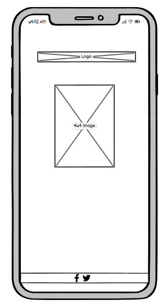

# **PokeBattle**

A toptrumps like webapp created for the second milestrone projects for Code Institues full stack developer course. 

[The deployed website can be found here.](https://monkphin.github.io/PokeBattle/)

//Insert mockups

# Contents 

- [User Experience](#user-experience)

  - [Site Owner Goals](#siteowner-club-goals)
  - [A Visitors Goals](#visitor-goals)

- [User Stories](#user-stories)

  - [Club Visitor](#site-visitor)
  - [Mobile User](#mobile-user)
  - [Club Owner](#site-owner)

- [Design](#design)

  - [Wireframes](#wireframes)
  - [Colour Palette](#colour-palette)
  - [Typography](#typography)
  - [Images](#images)
  - [Icons](#icons)

- [Features](#features)

  - [Header](#header)
  - [Footer](#footer)
  - [Home Page](#home-page)
  - [Game Page](#game-page)
  - [404 Page](#404-page)
  - [Future Features](#future-features)

- [Bugs and Issues](#bugs-and-issues)

  - [Index Page](#index-page)

- [Technology](#technology)

  - [Languages](#languages)
  - [Frameworks and Programs](#frameworks-and-programs)

- [Testing](#testing-and-validation)

  - [HTML Validation](#html-validation)
  - [CSS Validation](#css-validation)
  - [Javascript Validation](#javascript-validation)
  - [Accessibility](#accessibility)
  - [User Testing](#user-testing)
  - [User Stories](#user-story-testing)
  - [Performance](#performance)
  - [Device and Browser Testing](#device-and-browser-testing)
  - [Responsiveness](#responsiveness)

- [Version Control and Deployment](#version-control-and-deployment)
  - [Repository Creation](#repo-creation)
  - [Cloning Locally](#cloning-locally)
  - [Version Control](#version-control)
    - [CLI](#CLI)
    - [GitHub Website](#github-website)
  - [Branching](#branching)
  - [Deployment](#deployment)

- [Credits](#credits)

# User Experience

PokeBattle is an online toptrumps like game created to allow fans of the Pokemon series and TopTrumps games to have a single player game that can be played online. Due to the nature of the game and the IP, the site needs to be relatively simplistic in its display as well as using a bright, simple colour pallette. 

# Design
The design needed to be realtively simplistic, reflecting the nature of the game and IP in use. Ideally with minimal moving content, with the pertinent data, such as cards, output etc all being visible on a single screen. This meant using CSS query selectors to allow for the cards to be displayed side by side when shifting resolutions. Since on smaller screens any other card positioning would result in some data being pushed off the bottom. Overall the design has been kept deliberartely clean and simple in order to not distract from the main content. With areas of note being called out in bounding boxes that sit above the background. Initial testing was done with drop shadows on these elements and the cards. However it was deccided that the shaows detracted from the overall clean look and could lead to potential distraction due to the UI being a little too busy. 

## Wireframes:

Wireframes were created with Balsamiq software to provide rough mockups for layout.

Homepage

Game

404

## Colour Palette.

The colours selected were chosen to be inline with the bright, bold colours in use by the Pokemon IP, keeping things relatively simple but allowing all the elements to clearly standout and be viewable, as well as text to be legible. 

After some experimentation I settled on a simple range of colours between blue and white, since these seemed to be most pleasent without providing too much conflict with the varying colours of the cards. 

## Typography.

The font was picked due to being somewhat reflective of the Pokemon IP's font, while also remaining clear to read at varying font sizes and weights. 
Based on the simple appearance of the cards and IP as a whole I elected to stick to a single font to ensure this simplicity was reflected throughout. 

## Images
Images were sourced from a few locations - the pokemon themselves were from PokemonDB, the logos from a PokemonGo fan site, the cards from a Pokemon card making website. Credits for these will be provided at the end of the readme. 

## Icons

Icons were provided by [FontAwesome](https://fontawsome.com)

# Features

The website consists of 3 pages:
- home page
- game page
- 404 page

The game page is normally only accessible via the 'play game' button, once the player has entered their name into the text field. If the player tries to bypass entering their name an alert is generated advising them to enter their name. The custom 404 page is present in case a visitor somehow manages to access a nonexistent part of the website and offers methods to get back to the index page. 

## Logo
The header exists predominantly to show the sites logo. However it is clickable and will return the player back to the index page should they feel the need to navigate away from the game page while remaining on the website. It has two differently sized images to allow for better rendering on devices of differing capabilities. The appropriate image is picked by a javascript function, which calls on a helper function to determine the size of the window, allowing the appropriate image to be selected. 

## Hero Image
The hero image is displayed on the home page only. Ot provides a picture of two pokemon trainers about to battle, helping to give a sense of what is to come to the visitor where the game will see you face off against a computer controlled opponent. Its fully responsive and will adjust to meet the dimensions of the screen that is being used to browse the website. 

## Instructions
These are provided to ensure that players know the basics of how the game will function. Advising on how the game round should flow, what the objective of the turn and game is, as well as how many cards the two players have. This also presents an opportunity for the player to enter their name, which is called on at the end of hte game to congratulate or commiserate with the with player. Like other aspects of the site this is fully responsive and will react to varying screen resolutions, adjusting as needed. 

## Footer
The footer provides links to the the site owners socials, in this case Facebook, Github, twitter and LinkedIn. 

## Homepage

## Game Page

## 404 Page

## Future Features

# Bugs and issues.
Had to refactor HTML due to initially using a mix of flexbox and bootstrap to try to achive the layout I was aiming for, this was causing significant issues with rendering which were proving too complex to fix, so decided to simplify things and shifted to using plain CSS for the index page. 

Need to add a slight pause before allowing player to interact with their cards again after the opponent players turn. While this isnt causing a specific issue I can see, it does mean that the player can, via spamming the card buttons leave themselves unaware of the outcome of the opponent turn. Have tried to do this in a few places but have never been able to get it to work. 

Tabbed navigation will sometimes allow the spamming of stat option presses in some situations, causing functions to be triggered before they're supposed to be (Ie before the end of the current turn) This is rare and isnt easily replicable sadly so I have been unable to identify the root cause. 

# Technology.

## Languages

THe site is built with HTML, CSS and Javascript. It also calls on external CSS and Javascript from Bootstrap and FontAWesome, which are used to assist with layout, using bootstraps grid system and icons from FontAwesome. Much of the content on the game page is generated dynamically by the Javascript, while the index page and 404 are mostly built with static HTML, since they needed very little interactivity. 

## Frameworks and Programs. 

- Bootstrap 5.3.3

  - Used for layout and positioning.

- W3Schools

  - Used for help with CSS and Javascript.

- Git

  - Used for version control, storage and deployment.

- GoogleFonts

  - Used to import fonts to the stylesheet.

- VSCode

  - IDE of choice.

- Balsamiq

  - Wireframing program.

- WAVE

  - Used to assist with accessibility checks.

- Techsini

  - Mockup generator.

- Google Dev Tools

  - Used to help with troubleshooting.

- Pixelmator

  - Users for editing and resizing images. 

- Favicon.io

  - Used to generate a Favicon.

- Prettier

  - Used to format files  

# Testing and Validation

## HTML Validation  

[W3Schools HTML Validator](https://validator.w3.org/)

## CSS Validation

[W3Schools CSS Validator](https://jigsaw.w3.org/css-validator/)

## Accessibility

headings were not conforming to standards - amended how text was rendered and adjusted how headings were used to ensure that these conform to web standards. 

Stats were not initially selectable via tabbing - amended the javascript file to give stats the tabindex of 1 to ensure these were tabbable.

[WAVE](https://wave.webaim.org) 

## User Testing.

## Performance

## Device and Browser Testing

## Responsiveness

# Version control and Deployment

## Repo Creation

## Cloning locally

## Deployment

# Credits 
PokeBattler Logo taken from https://www.pokebattler.com/
POkemon images taken from https://pokemondb.net/pokedex/national
card backgrounds taken from https://pokecardmaker.net/creator
Sad Pikachu taken from https://www.deviantart.com/jujumays/art/A-Very-Sad-Pikachu-929558432